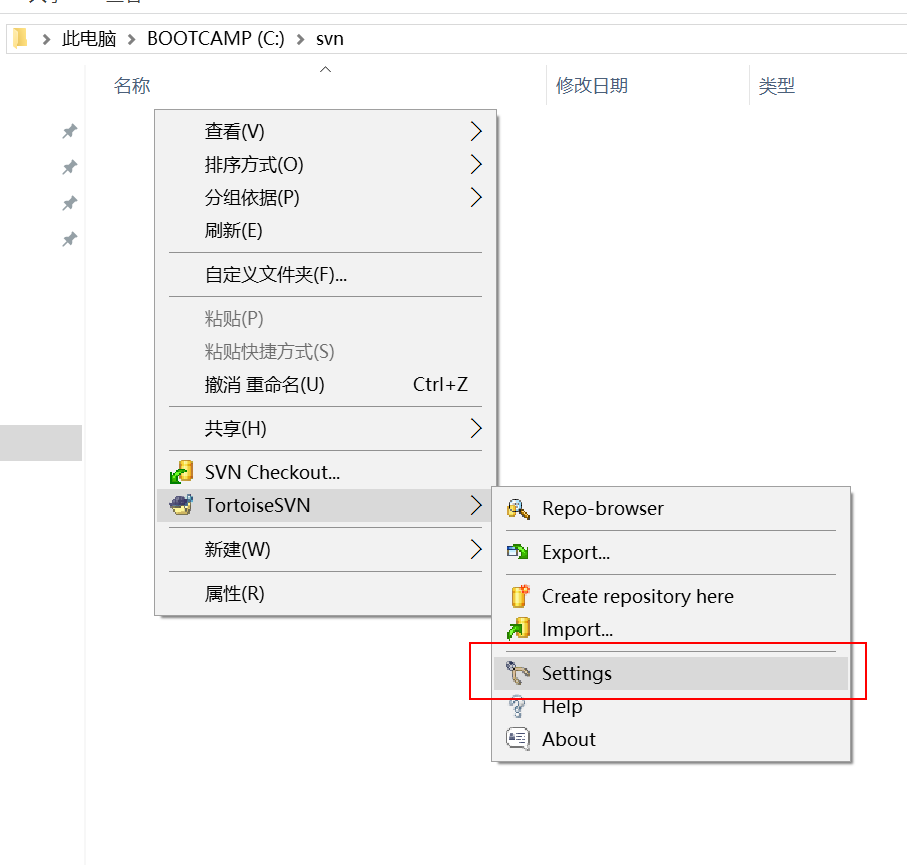

**返璞归真,构建高效课堂——韩愈《师说》教学设计**

**一、文本简析**

《师说》是人教版高中语文必修Ⅲ第三单元的第四篇文章，属于自读课文。这个单元学习的是古代议论性散文，包括《寡人之于国也》《劝学》《过秦论》和《师说》，在读懂文章字面意思的基础上，要求“多琢磨文章立论的方法，注意其严密周详的论证逻辑”。

《师说》文字浅易，除几个人名外，没有生僻艰涩字词，文意也较少理解障碍，适合学生自读；而其整散结合的句式使文章有很好的节奏，适合朗读；其严谨的思维和论证能给学生很好的逻辑思维训练和议论文写作方法示范。

**二、目标定位**

1.把握文章的语气和节奏，积累语感。

2.学习论证方法，梳理论证思路，提高概括和分析问题的能力。

3.感受大家情怀，提升人文精神。

**三、方法阐述**

读写句读，自主探究。

中学阶段的文言文学习应该特别注意基础的训练和夯实，能顺畅地朗读和正确地书写，对于学生准确理解意思、积累文言知识都有直接的帮助。而自主给文言文添加标点，对于提高学生文言文阅读能力更是有着重要意义。在正常状态下，学生所见到的文言文基本上是已经添加了完整标点符号的材料，“原始”状态的“天书”几乎不可能与学生谋面；一些资料或考试中的断句题往往也只限于简短的几个句子，一般没有整篇文章的断句。《师说》属于自读课文，文字并不艰深，但其中包含的道理和逻辑思辨却是值得细细体味的。教师有必要提供给学生学习的“抓手”，使他们寻找到思维的突破口，从而“牵一发而动全身”，最终能在讨论和交流中理清思维的脉络，训练和提高自己的逻辑思维能力。

**四、教学流程**

（一）自主阅读

1.具体操作。要求学生集中注意力，通过朗读或默读的形式通读课文，结合注释以及课后练习、资料等，尽自己最大努力把握课文内容。时间约为五分钟。

2.设计意图。在不提前预习、也无相关背景介绍的情况下，学生通过“第一印象”感知文本，能更真实地显现自身在文言文学习方面的实际能力。大量信息在短时间内集中冲击学生大脑，能有效地激发其活跃度，增加其敏感度，使信息的接受和掌握达到最大化。教师最好不提前告诉学生要听写，以免学生“死记硬背”而忽略对意思的理解。

（二）朗读听写

1.具体操作。教师按照一定的语速逐句朗读课文，尽量保持匀速，一句只朗读一遍。学生逐句听写，不写标点，也不留空格；可以隔行书写，留出空白以备修改。

2.设计意图。逐句听写既是对学生自主阅读效果的检查，也能训练学生“听”和“写”的能力。听写的既是完整的句子，也是完整的文章，所以，根据上下文听清楚字音，准确书写字形，并且不添字、漏字，这更是对学生理解能力的考验。每个句子只念一遍，学生在高度紧张的状态中，耳、脑、手等各器官高度配合，会有高强度的学习状态和高效率的学习效果。不写标点、不留空格是为了接下来“断句”环节的需要。时间约为十二分钟。

（三）断句标点

1.具体操作。学生给自己听写的《师说》先用斜线断句，再根据意思添加标点；能力强的学生也可以直接添加标点。在断句和添加标点的过程中，应该根据上下文意同时检查和修改听写中出错的文字，包括错别字、添字、漏字等。

2.设计意图。这个环节既可以训练学生语感和节奏感，也能增强其阅读理解能力———斜线断句和添加标点是不同层次的理解要求；如果学生凭记忆能根据老师朗读的节奏断句，至少也能训练机械记忆能力。时间约为五分钟。

（四）检查提问

1.具体操作。学生对照原文，逐句、逐字核对自己听写的文字和添加的标点，有错误则逐一修改；同时，思考错误的产生原因。如果因此发现有文意理解困难之处，则及时提出，由老师组织讨论解决。如果时间充裕，可以增加同桌相互检查的步骤，以更准确、更彻底地纠正错误和理解意思。时间约为六分钟。

2.设计意图。逐句、逐字检查可以培养学生严谨认真的意识和一丝不苟的态度———要特别提醒不能求快而应求准，核对的过程更应成为理解的过程，思考出错原因更是提高分析能力和自主学习能力的重要手段。

（五）分析探究

1.具体操作。

（1）引导学生阅读注释中对韩愈的介绍，关注“古文运动”“文起八代之衰”“唐宋八大家”等关键词。根据学情，可以由学生或老师补充介绍相关常识———议论文的阅读比其他文学作品更需要知人论世，了解背景才有可能真正深入到文字深处和作者内心。

（2）再由注释中的“这篇文章是韩愈写给他的学生李蟠的”引出对作者行文思路的解读。教师先引导学生找出第四段“余嘉其能行古道，作《师说》以贻之”，明确作者的写作目的，同时提醒学生区分表面目的和真正原因，从而抓住“不拘于时”中的“时”，懂得“文章合为时而著”———为现实服务才是文章的真实写作目的。“不拘于时”的直接表现就是“学于余”，所以，“拘于时”的表现就该是“不学”，这就涉及了《师说》的核心———对是否应该“从师而学”的思考和缺乏“从师而学”社会风气的批判。

（3）社会现实的相关内容出现在第二段，由此可以引出对第二段的理解。第二段明显地使用到对比论证的方法，共有三组对比：“古之圣人”与“今之众人”“爱其子，择师而教”与“于其身，则耻师”和“巫医乐师百工”与“士大夫之族”。对比中批判了当时社会现状：耻学于师。这里需点明作者论证的角度是反面论证。在这部分的分析中，要重点阐明学校育的“授之书而习其句读”与韩愈主张的“传其道解其惑”的区别，前者重在具体知识的传授，后者重在解人生之惑和传儒学之道。

（4）由第二段的反面论证，顺势引出第三段的正面论证。通过“孔子”的例子，讲解事例论据选择的典型性，以及事例论据与道理论据的结合。

（5）由第二、三段的正反结合论证，引出对论点的把握，从而进入第一段内容的分析，重点是论点的确定和论点提出的方法，以及第一段的行文思路。

（6）最后，总结整篇文章的行文思路，归纳一般议论文的写作模式。时间约为十二分钟。

2.设计意图。此环节重点在训练学生逻辑思维能力和迅速抓住文章主线的能力，同时学习简单有效的论证方法。这部分看似环节较多，似乎很复杂，其实这些内容步步相连、环环相扣，教师在课堂上只需起到穿针引线的作用，具体分析基本可以由学生在思考和讨论中完成；要注意避免教师“放手”太少，讲得太多———本来清楚明了的问题往往因为过细、过滥的分析而变得繁琐、模糊。

**五、教学反思**

第一次尝试在高中采用听写的方式接触、理解课文，原因已在前文分析到。从具体操作效果来看，“自主阅读”“朗读听写”“断句标点”和“检查提问”四个环节进行都非常顺利，学生在高“强度”训练环境下，身体和精神的注意力处于高度集中的氛围中，能够很高效地完成学习任务，整个课堂节奏很好。而“分析探究”环节的效果好坏与教师个人的课堂驾驭能力强弱有直接的关系。所以说，教师引导学生沿着主线保持逻辑思维的顺畅连贯而不“旁逸斜出”是成功的关键。努力保持学生学习的兴趣和欲望，简洁明了、不贪多求全地处理文章是能否在一节课完成教学任务的另一个关键。
